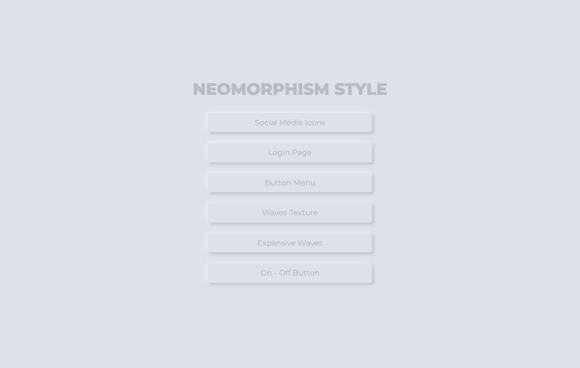

# ✍🏻 Neomorphism Style

Researching about some potential new trends in UI design, one caught my attention, it was neumorphic style, this style pretends to extrude from the background. It’s a raised shape made from the exact same material as the background.

## 👩🏻‍💻Examples 

## 💥Demo 

[You interact with all elements here](https://martamullor.github.io/neomorphism-frontend/)

## Contribute

Support by giving a ⭐. 
Any suggestions are welcome!

## My portfolio

[Link to Portfolio](http://www.martamullor.com/)
